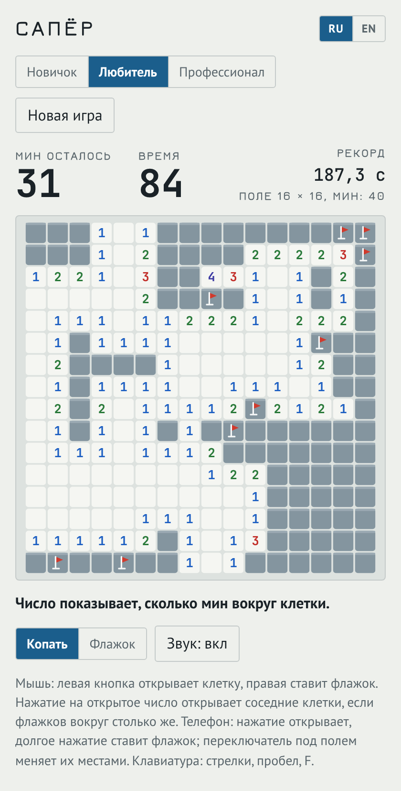
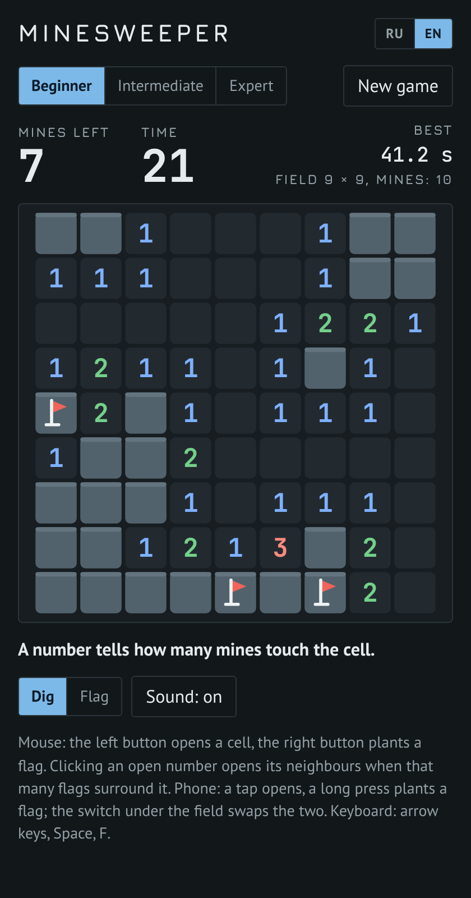

# Сапёр

[English version](README.md)

Браузерная версия классической игры. На поле спрятаны мины; откройте все клетки без мин и ни разу не наступите на мину.

**[Играть в браузере](https://posoxai.github.io/MinesweeperGame/)**

  
  

Слева светлая тема с русским интерфейсом, справа тёмная с английским.

## Правила

- Число в открытой клетке показывает, сколько мин в восьми соседних клетках.
- Клетка без мин по соседству открывает всех своих соседей сама.
- Флажок отмечает клетку, где вы предполагаете мину. Счётчик «Мин осталось» показывает число мин минус число флажков.
- Наступили на мину — партия проиграна. Поле показывает все мины, а неверные флажки перечёркнуты.
- Партия выиграна, когда открыты все клетки без мин. Ставить флажки для победы не обязательно.

## Размеры поля

| Сложность | Поле | Мин |
| --- | --- | --- |
| Новичок | 9 × 9 | 10 |
| Любитель | 16 × 16 | 40 |
| Профессионал | 30 × 16 | 99 |

На узком экране поле «Профессионала» повёрнуто набок, 16 × 30, чтобы клетки оставались достаточно крупными для пальца.

## Первый ход

Мины расставляются после первого нажатия. В открытой клетке и восьми клетках вокруг неё мин не будет, поэтому первый ход всегда открывает участок поля.

Дальше всё как в оригинале: поле не обязано решаться одной логикой, иногда приходится угадывать.

## Управление

- Мышь: левая кнопка открывает клетку, правая ставит или снимает флажок.
- Нажатие на открытое число открывает его закрытых соседей, если флажков вокруг ровно столько же. Если флажок стоит неверно, так можно подорваться.
- Телефон: нажатие открывает, долгое нажатие ставит флажок. Переключатель «Копать / Флажок» под полем меняет их местами.
- Клавиатура: стрелки двигают курсор, пробел или Enter открывает клетку, F ставит флажок.

Время идёт с первого открытия клетки. Рекорд хранится отдельно для каждой сложности, с точностью до десятой секунды. Незаконченная партия, рекорды и настройки хранятся в браузере игрока.

## Язык

Интерфейс на русском и английском. Русский включается сам, если он есть в списке языков браузера, иначе игра открывается на английском. Переключатель RU/EN запоминает выбор.

## Как запустить

Вся игра лежит в одном файле `index.html`. Сборка и зависимости не нужны.

- Локально: откройте `index.html` в браузере.
- По ссылке: игра опубликована через GitHub Pages по адресу https://posoxai.github.io/MinesweeperGame/. Каждый коммит в `main` обновляет её автоматически.

Шрифты загружаются с Google Fonts. Без сети игра работает на системных шрифтах.

## Счётчик посещений

Опубликованная страница считает посещения через [GoatCounter](https://www.goatcounter.com/). По словам сервиса, он не ставит cookies и не хранит личных данных. Когда `index.html` открыт с диска, счётчик не работает.

## Авторство

Игру написал Claude, ИИ-ассистент компании Anthropic: логику, графику на canvas, звук и оформление страницы.

Правила и три размера поля взяты из классического «Сапёра», известного по Windows. Оформление этой версии своё.

Идея сделать браузерную версию принадлежит posoxAI.

## Лицензия

MIT. Полный текст в файле [LICENSE](LICENSE).
